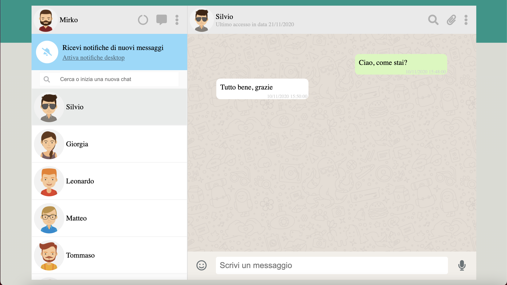

# WhatsApp con Vue
## tecnologie
* HTML
* CSS
* JavaScript (Vue)
## descrizione
replica della versione web di WhatsApp;
* possibilità di selezionare un contatto con cui chattare
* possibilità di filtrare i contatti grazie alla barra di ricerca
* possibilità di chattare con i vari contatti; dopo qualche secondo dall'invio di un messaggio, generazione automatica di un messaggio standard di risposta
* i messaggi inviati e i messaggi generati automaticamente presentano l'effettiva data e ora d'invio

